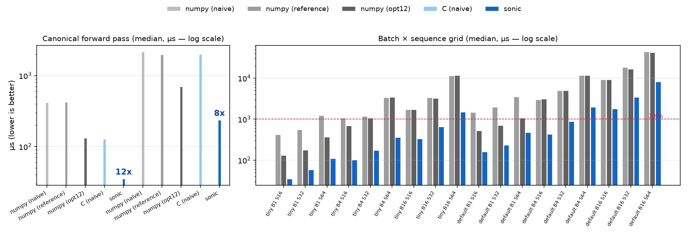

# sonic

A transformer forward pass written in C and hand-tuned until it runs at the
machine's practical limit — 35 µs for the TINY config on a 2-core Colab CPU
node, versus 420 µs for a clean numpy implementation of the same model.



## What works

- From-scratch C forward pass: blocked GEMM, fused QKV/attention/FFN, fast-exp softmax
- 35 µs (TINY) / 236 µs (DEFAULT) median forward — 12x / 8.4x faster than a numpy reference, 3.7x / 3.0x faster than the best numpy implementation
- 13/18 batch × sequence cells sub-millisecond on the eval grid
- Max abs error ~1e-6 against a float64 reference
- No ML dependencies — plain C, builds with `cc` and OpenMP

## Quick start

```sh
bash ground_up/build.sh
python3 evals/eval_correctness.py --impl c_ground_up
python3 evals/eval_latency.py --impl c_ground_up --cfg tiny --node local
```

## How it works

One C function per forward pass: a fused QKV matmul, blocked attention with a
vectorized causal row-softmax, a matmul FFN, and an output projection — all
through a from-scratch blocked GEMM kernel with compile-time-tuned tiles and
OpenMP. The softmax exp is a degree-6 Chebyshev fit folded into the float
exponent field. Everything is fp32; correctness is gated at 1e-3 against a
float64 numpy reference.

## Status

At the machine floor on Colab CPU nodes (Skylake-class, AVX2): the measured
latency-vs-error frontier is flat fp32, and int8/bf16/attention variants all
lose to the fp32 kernel on this hardware — see `notes/novelty_findings.md`.

## License

[MIT](LICENSE)
